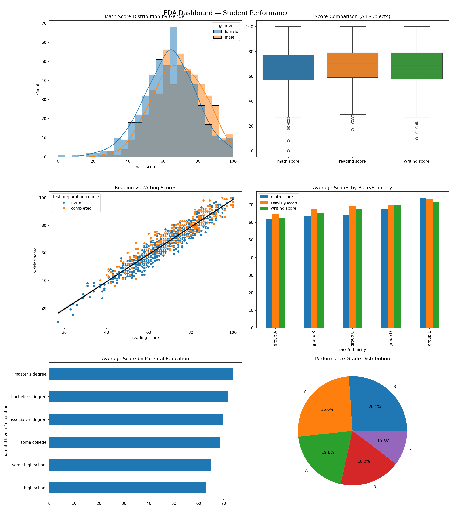
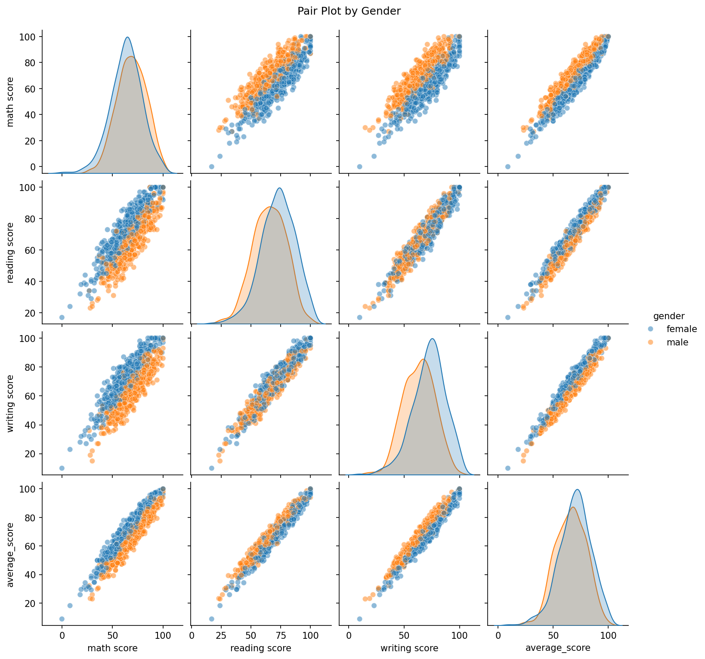
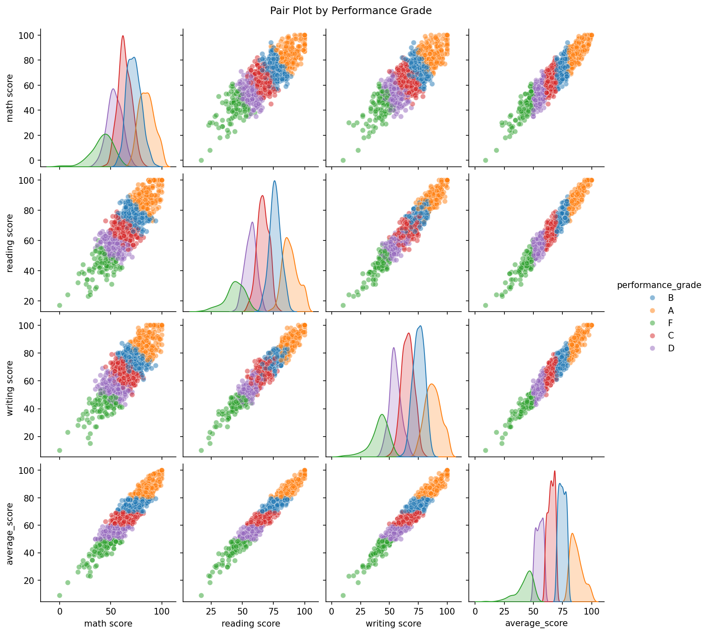

# Student Performance Analysis using Python  
### AI/ML Internship — Week 1  

---

## 👩‍💻 Author  
**Bisma Imran**  
BS Computer Science  

---

## 📌 Overview  

This project explores student performance using Python to understand how different factors affect academic results. Instead of just looking at scores, the focus was on finding patterns and relationships between variables like gender, parental education, and test preparation.

The goal was to move from raw data to meaningful insights through a structured analysis process, similar to how real-world data problems are approached.

---

## 📊 Dataset  

The dataset contains records of **1000 students**, including:

- Demographic information (gender, race/ethnicity)  
- Background factors (parental education, lunch type)  
- Preparation level (test preparation course)  
- Academic scores (math, reading, writing)  

This combination makes it possible to study both performance and the factors behind it.

---

## ⚙️ Approach  

The project was completed in a step-by-step workflow:

### 1. Data Understanding  
Started by checking the structure, data types, and overall quality of the dataset.

### 2. Exploratory Analysis  
Used statistics and visualizations to understand score distributions and relationships between subjects.

### 3. Group Comparisons  
Compared performance across:
- Gender  
- Parental education levels  
- Test preparation status  
- Race/ethnicity  

### 4. Feature Engineering  
Created new features to make the data more meaningful:
- Total and average scores  
- Performance grades  
- High achiever identification  
- Lowest scoring subject  

### 5. Deeper Analysis with NumPy  
Performed manual statistical calculations to better understand distributions and extreme values.

### 6. Visualization Dashboard  
Built a combined dashboard to present key findings clearly in one place.

---

## 📈 Key Insights  

- Students perform consistently better in **reading and writing** than in math  
- **Test preparation** leads to noticeable improvement across all subjects  
- There is a clear **gender pattern**:
  - Females perform better in reading and writing  
  - Males perform slightly better in math  
- Students with **higher parental education** tend to score higher  
- Math scores show **more variation**, suggesting it is more challenging for many students  

---

## 📊 Visual Analysis  

Different types of visualizations were used to understand the data:

- Distribution plots to see how scores are spread  
- Box plots to compare subjects  
- Scatter plots to observe relationships between scores  
- Heatmaps for correlations and grouped analysis  
- Pair plots to explore multi-variable patterns
  
## 📊 EDA Dashboard   

---

## 📊 Visualizations

### Pairplot (by Gender)

### Pairplot (by Grade)

## 🧠 What Makes This Analysis Useful  

This project does more than just describe data. It shows how multiple factors combine to influence performance. For example, test preparation and parental education both affect scores, but not in exactly the same way for every group.

This kind of analysis is important before applying machine learning, because it helps understand what actually matters in the data.

---

## 🛠️ Tools Used  

- Python  
- NumPy  
- Pandas  
- Matplotlib  
- Seaborn  

---

## 📁 Project Files  

- `Week1_Student_Performance_Analysis_BismaImran.ipynb`  
- `eda_dashboard.png`  
- `pairplot_scores.png`  
- `pairplot_grades.png`  

---

## 📌 Final Thoughts  

This project helped build a strong foundation in data analysis by working through a complete workflow from start to finish. It also showed how small factors can create meaningful differences in outcomes when analyzed properly.

The same approach can be extended further to build predictive models in future work.

---
